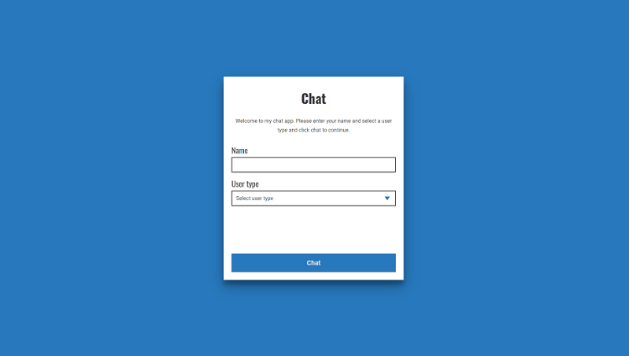
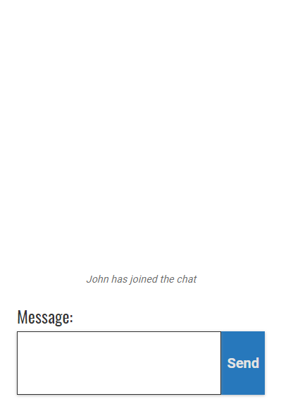
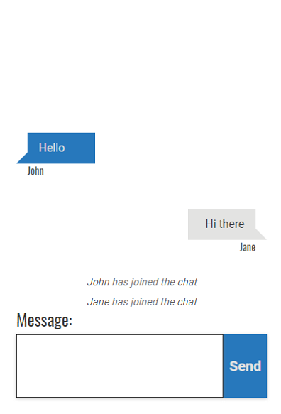

# Vue chat app
This is a chat application that will allow two uses to chat in real-time via their browser.

[Demo](chat.morganpeck.com) 


  
## Built with: 
- [Vue](https://vuejs.org/)
- [NPM](https://www.npmjs.com/)
- [Express](https://expressjs.com/)
- [SASS](https://sass-lang.com/)
- [Node](https://nodejs.org/en/)
- [Socket.IO](https://socket.io/)
# Getting started
## Cloning repo
`git clone https://github.com/mpeck99/chat-app.git`
## Installing node_modules and packages
```npm install```
## Running locally for development
```npm run start```
```npm run serve```
## Compiling and minifying for production
```npm run build``` 
## Links and fixes file
```npm run lint```
